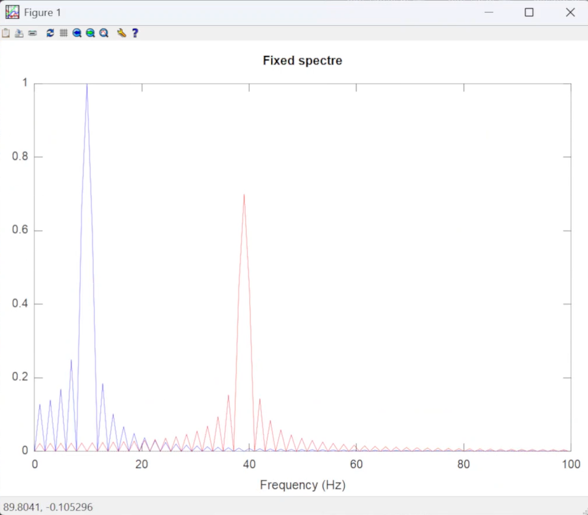

---
## Front matter
lang: ru-RU
title: Лабораторная работа
subtitle: Номер 2
author:
  - Андрюшин Н. С. 
institute:
  - Российский университет дружбы народов, Москва, Россия
date: 01 января 1970

## i18n babel
babel-lang: russian
babel-otherlangs: english

## Formatting pdf
toc: false
toc-title: Содержание
slide_level: 2
aspectratio: 169
section-titles: true
theme: metropolis
header-includes:
 - \metroset{progressbar=frametitle,sectionpage=progressbar,numbering=fraction}
 
## Fonts
mainfont: IBM Plex Serif
romanfont: IBM Plex Serif
sansfont: IBM Plex Sans
monofont: IBM Plex Mono
mathfont: STIX Two Math
mainfontoptions: Ligatures=Common,Ligatures=TeX,Scale=0.94
romanfontoptions: Ligatures=Common,Ligatures=TeX,Scale=0.94
sansfontoptions: Ligatures=Common,Ligatures=TeX,Scale=MatchLowercase,Scale=0.94
monofontoptions: Scale=MatchLowercase,Scale=0.94,FakeStretch=0.9
mathfontoptions:
---

# Информация

## Докладчик

:::::::::::::: {.columns align=center}
::: {.column width="70%"}

  * Андрюшин Никита Сергеевич
  * Студент
  * Российский университет дружбы народов

:::
::: {.column width="30%"}

:::
::::::::::::::

## Цель работы

Приобретение практических навыков по установке и конфигурированию DNS-сервера, усвоение принципов работы системы доменных имён.

## plot_sin

Создадим файл plot_sin (рис. [-@fig:001]).

{height=60%}

## Код

Вставим следующий код (рис. [-@fig:002]).

{height=60%}

## График функции

И запустим его. Как видим, отрисовался график (рис. [-@fig:003]).

{height=60%}

## новый код

Теперь модифицируем его так, чтобы было 2 функции (рис. [-@fig:004]).

{height=60%}

## Отрисовка 2 функций

Теперь мы видим, что у нас 2 функции на графике (рис. [-@fig:005]).

{height=60%}

## Создание файла

Создадим файл meandr (рис. [-@fig:006]).

{height=60%}

## Код

Напишем в него следующий код (рис. [-@fig:007]).

{height=60%}

## Графики

Видим следующие 8 графиков (рис. [-@fig:008]).

{height=60%}

## Код с синусами

Теперь перепишем код с косинусов на синусы (рис. [-@fig:009]).

{height=60%}

## Графики

В результате получаем те же графики, но смещенные (рис. [-@fig:010]).

{height=60%}

## Создание файла

Создадим новый файл (рис. [-@fig:011]).

{height=60%}

## Код файла

Напишем слудующий код (рис. [-@fig:012]).

{height=60%}

## Вывод

Посмотрим на вывод (рис. [-@fig:013]).

{height=60%}

## Модификация кода

Теперь слегка модифицируем код (рис. [-@fig:014]).

{height=60%}

## Результат

И посмотрим на результат (рис. [-@fig:015]).

{height=60%}

## код

Снова модифицируем код (рис. [-@fig:016]).

{height=60%}

## Результат

И посмотрим на результат (рис. [-@fig:017]).

{height=60%}

## Новый файл

Создадим новый файл (рис. [-@fig:018]).

{height=60%}

## Код

Напишем слудующий код (рис. [-@fig:019]).

{height=60%}

## Результат

Посмотрим на результат (рис. [-@fig:020]).

{height=60%}

## Новый файл

Создадим новый файл (рис. [-@fig:021]).

{height=60%}

## Написание кода

И напишем в нём следующее (рис. [-@fig:022]).

{height=60%}

## результат

Посмотрим на результат (рис. [-@fig:023]).

{height=60%}

## Второй вывод

И на второй вывод (рис. [-@fig:024]).

{height=60%}

## файлы

Создадим следующие файлы (рис. [-@fig:025]).

{height=60%}

## signal

Убедимся, что установлен пакет signal (рис. [-@fig:026]).

{height=60%}

## main

Напишем main функцию (рис. [-@fig:027]).

{height=60%}

## unipolar

И коды для различных алгоритмов (рис. [-@fig:028]).

{height=60%}

## ami

ami (рис. [-@fig:029]).

{height=60%}

## bipolarnrz

bipolarnrz (рис. [-@fig:030]).

{height=60%}

## bipolarrz

bipolarrz (рис. [-@fig:031]).

{height=60%}

## manchester

manchester (рис. [-@fig:032]).

{height=60%}

## diffmanc

diffmanc (рис. [-@fig:033]).

{height=60%}

## calcspectre

calcspectre (рис. [-@fig:034]).

{height=60%}

## meandr

meandr (рис. [-@fig:035]).

{height=60%}

## maptowave

maptowave (рис. [-@fig:036]).

{height=60%}

## результат

И посмотрим на итоговый результат (рис. [-@fig:037]).

{height=60%}

## Выводы

в результате выполнения работы была установлена система
