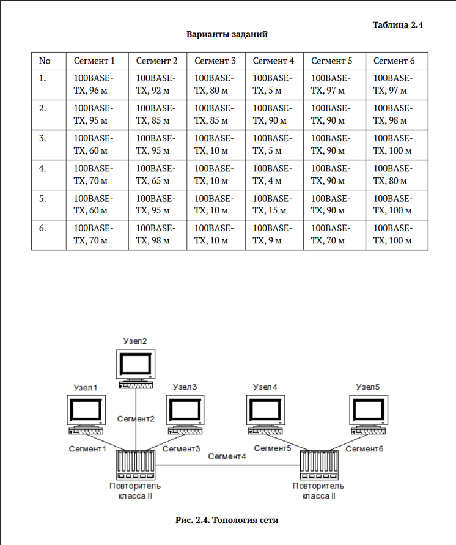
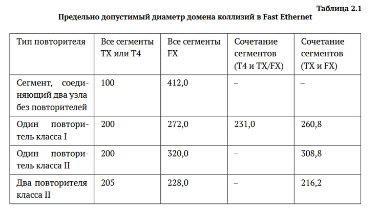
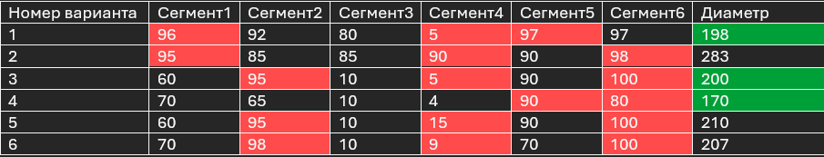
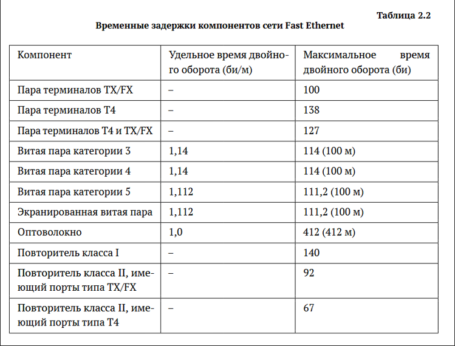

---
## Front matter
lang: ru-RU
title: Лабораторная работа
subtitle: Номер 2
author:
  - Андрюшин Н. С. 
institute:
  - Российский университет дружбы народов, Москва, Россия
date: 01 января 1970

## i18n babel
babel-lang: russian
babel-otherlangs: english

## Formatting pdf
toc: false
toc-title: Содержание
slide_level: 2
aspectratio: 169
section-titles: true
theme: metropolis
header-includes:
 - \metroset{progressbar=frametitle,sectionpage=progressbar,numbering=fraction}
 
## Fonts
mainfont: IBM Plex Serif
romanfont: IBM Plex Serif
sansfont: IBM Plex Sans
monofont: IBM Plex Mono
mathfont: STIX Two Math
mainfontoptions: Ligatures=Common,Ligatures=TeX,Scale=0.94
romanfontoptions: Ligatures=Common,Ligatures=TeX,Scale=0.94
sansfontoptions: Ligatures=Common,Ligatures=TeX,Scale=MatchLowercase,Scale=0.94
monofontoptions: Scale=MatchLowercase,Scale=0.94,FakeStretch=0.9
mathfontoptions:
---

# Информация

## Докладчик

:::::::::::::: {.columns align=center}
::: {.column width="70%"}

  * Андрюшин Никита Сергеевич
  * Студент
  * Российский университет дружбы народов

:::
::: {.column width="30%"}

:::
::::::::::::::

## Цель работы

изучение принципов технологий Ethernet и Fast Ethernet и практическое освоение методик оценки работоспособности сети, построенной на базе технологии Fast Ethernet.

## Задание

{height=60%}

## Первая модель

{height=60%}

## Первая модель

{height=60%}

## Вторая модель

{height=60%}

## 1 вариант

Самый худший путь имеет следующее количество временных интервалов:   
100 (узел) + 96 * 1,112 (первый сегмент) + 92 (повторитель класса 2) + 5 * 1,112 (четвёртый сегмент) + 92 (повторитель класса 2) + 97 * 1,112 (пятый сегмент) = 504,176  
Прибавляем 4 => 508,176  

## 2 вариант

Самый худший путь имеет следующее количество временных интервалов:   
100 (узел) + 95 * 1,112 (первый сегмент) + 92 (повторитель класса 2) + 90 * 1,112 (четвёртый сегмент) + 92 (повторитель класса 2) + 98 * 1,112 (шестой сегмент) = 598,584  
Прибавляем 4 => 602,584  

## 3 вариант

Самый худший путь имеет следующее количество временных интервалов:   
100 (узел) + 95 * 1,112 (второй сегмент) + 92 (повторитель класса 2) + 5 * 1,112 (четвёртый сегмент) + 92 (повторитель класса 2) + 100 * 1,112 (шестой сегмент) = 506,4  
Прибавляем 4 => 510,4  

## 4 вариант

Самый худший путь имеет следующее количество временных интервалов (Заметим, что путь отличается от того, что был в первой модели, так как он всего на 6 метров короче, но зато идёт через второй повторитель, который даёт гораздо больше задержки, чем 6 метров кабеля витой пары):   
100 (узел) + 70 * 1,112 (первый сегмент) + 92 (повторитель класса 2) + 4 * 1,112 (четвёртый сегмент) + 92 (повторитель класса 2) + 90 * 1,112 (пятый сегмент) = 466,368  
Прибавляем 4 => 470,368  

## 5 вариант

Самый худший путь имеет следующее количество временных интервалов:   
100 (узел) + 95 * 1,112 (второй сегмент) + 92 (повторитель класса 2) + 15 * 1,112 (четвёртый сегмент) + 92 (повторитель класса 2) + 100 * 1,112 (шестой сегмент) = 517,52  
Прибавляем 4 => 521,52  

## 6 вариант

Самый худший путь имеет следующее количество временных интервалов:   
100 (узел) + 98 * 1,112 (второй сегмент) + 92 (повторитель класса 2) + 9 * 1,112 (четвёртый сегмент) + 92 (повторитель класса 2) + 100 * 1,112 (шестой сегмент) = 514,184  
Прибавляем 4 => 518,184  

## Выводы

в результате выполнения работы были получены навыки анализа работоспособности ethernet сетей и их принцип работы
