---
## Front matter
title: "Отчёт о лабораторной работе"
subtitle: "Лабораторная работа 5"
author: "Андрюшин Никита Сергеевич"

## Generic otions
lang: ru-RU
toc-title: "Содержание"

## Bibliography
bibliography: bib/cite.bib
csl: pandoc/csl/gost-r-7-0-5-2008-numeric.csl

## Pdf output format
toc: true # Table of contents
toc-depth: 2
lof: true # List of figures
lot: true # List of tables
fontsize: 12pt
linestretch: 1.5
papersize: a4
documentclass: scrreprt
## I18n polyglossia
polyglossia-lang:
  name: russian
  options:
	- spelling=modern
	- babelshorthands=true
polyglossia-otherlangs:
  name: english
## I18n babel
babel-lang: russian
babel-otherlangs: english
## Fonts
mainfont: IBM Plex Serif
romanfont: IBM Plex Serif
sansfont: IBM Plex Sans
monofont: IBM Plex Mono
mathfont: STIX Two Math
mainfontoptions: Ligatures=Common,Ligatures=TeX,Scale=0.94
romanfontoptions: Ligatures=Common,Ligatures=TeX,Scale=0.94
sansfontoptions: Ligatures=Common,Ligatures=TeX,Scale=MatchLowercase,Scale=0.94
monofontoptions: Scale=MatchLowercase,Scale=0.94,FakeStretch=0.9
mathfontoptions:
## Biblatex
biblatex: true
biblio-style: "gost-numeric"
biblatexoptions:
  - parentracker=true
  - backend=biber
  - hyperref=auto
  - language=auto
  - autolang=other*
  - citestyle=gost-numeric
## Pandoc-crossref LaTeX customization
figureTitle: "Рис."
tableTitle: "Таблица"
listingTitle: "Листинг"
lofTitle: "Список иллюстраций"
lotTitle: "Список таблиц"
lolTitle: "Листинги"
## Misc options
indent: true
header-includes:
  - \usepackage{indentfirst}
  - \usepackage{float} # keep figures where there are in the text
  - \floatplacement{figure}{H} # keep figures where there are in the text
---

# Цель работы

Построение простейших моделей сети на базе коммутатора и маршрутизаторов FRR и VyOS в GNS3, анализ трафика посредством Wireshark

# Выполнение

Для начала запустим GNS-VM и GNS клиент, после чего создадим проект (рис. [-@fig:001]).

{#fig:001 width=70%}

В проекте сделаем такую схему. Эта схема состоит из 2 терминалов, связанных между собой свитчём (рис. [-@fig:002]).

{#fig:002 width=70%}

Запустим первый терминал. В нём мы настроим айпи следующим образом, как показано на экране. Адрес - 192.168.1.11, шлюз - 192.168.1.1 (рис. [-@fig:003]).

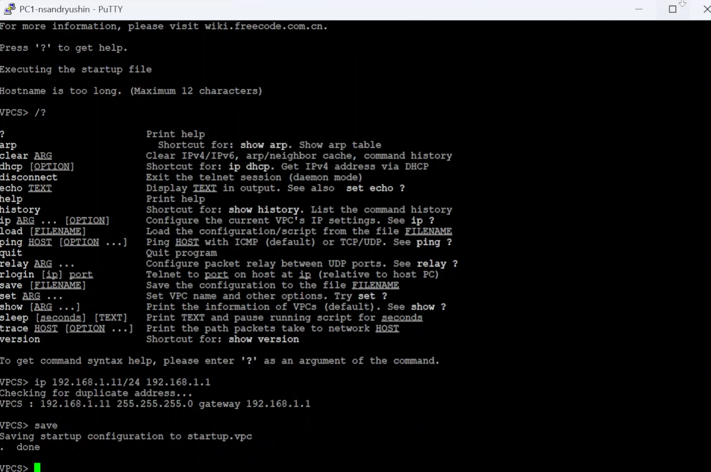{#fig:003 width=70%}

Ровно таким же способом настроим второй терминал, но ему дадим адрес 192.168.1.12. После этого попытаемся пингануться на первый терминал. Как видим, пакеты прошли (рис. [-@fig:004]).

{#fig:004 width=70%}

Теперь остановим все устройства (рис. [-@fig:005]).

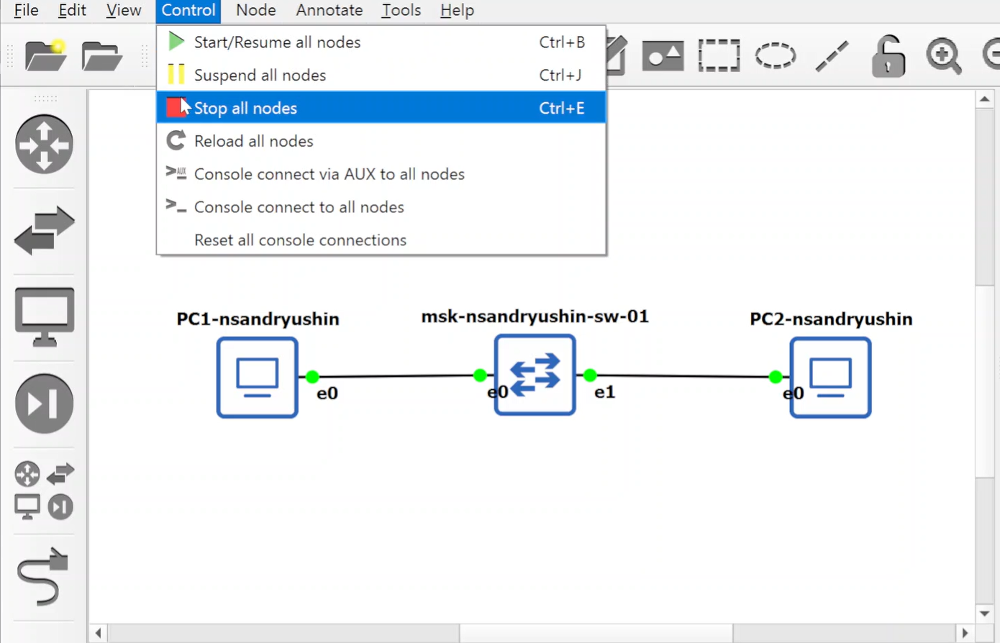{#fig:005 width=70%}

Перед повторным запуском сети мы начнём захват пакетов кабеля, идущего от первого терминала к свитчу (рис. [-@fig:006]).

{#fig:006 width=70%}

Выберем имя для файла дампа (рис. [-@fig:007]).

{#fig:007 width=70%}

После этого откроется Wireshark (рис. [-@fig:008]).

{#fig:008 width=70%}

Теперь мы запустим всю сеть (рис. [-@fig:009]).

{#fig:009 width=70%}

Теперь посмотрим на вывод Wireshark. Как мы видим, после запуска сети каждый терминал отправил несколько Gratuitous ARP пакетов. Это пакеты, которые устройство отправляет самому себе, оповещая всех участников сети о своём существовании (рис. [-@fig:010]).

{#fig:010 width=70%}

Откроем второй терминал и попробуем отправить первому терминалу один echo запрос через ping с помощью протокола icmp (рис. [-@fig:011]).

{#fig:011 width=70%}

В Wireshark обнаружим пару пакетов запрос-ответ по протоколу icmp (рис. [-@fig:012]).

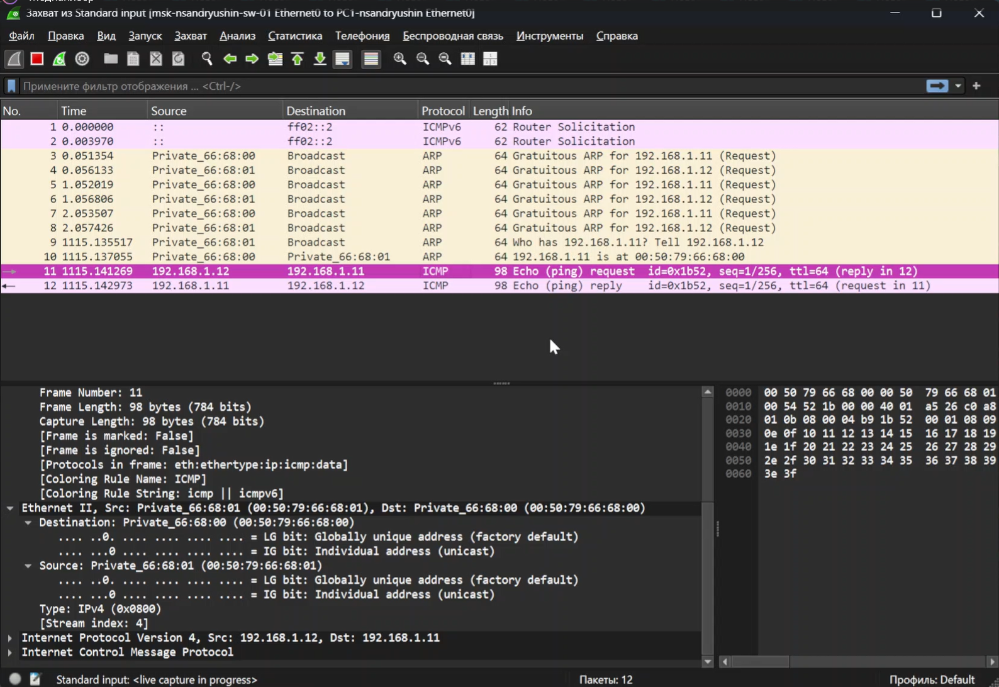{#fig:012 width=70%}

Разберём подробнее один из пакетов. В ICMP фрагменте мы видим тип 8 (echo (ping) request). Поле Data содержит простой набор байтов, шаблонный (рис. [-@fig:013]).

{#fig:013 width=70%}

Рассмотрим обратный пакет. Он будет сильно похож на предыдущий, но уже будет идти не от 2 терминала к первому, а наоборот. И тип уже будет 0 (echo (ping) reply) (рис. [-@fig:014]).

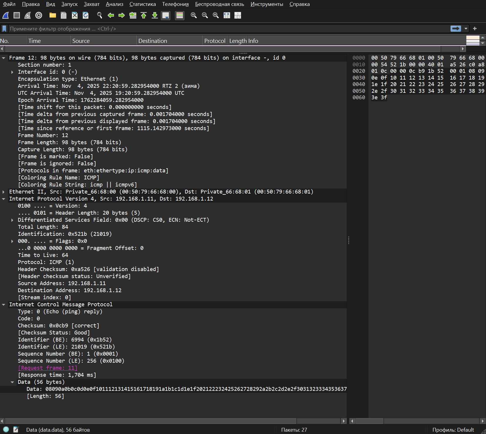{#fig:014 width=70%}

Теперь осуществим ping по протоколу udp (рис. [-@fig:015]).

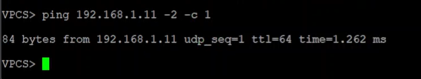{#fig:015 width=70%}

В Wireshark появится пара пакетов по протоколу UDP, опять же, формата запрос-ответ (рис. [-@fig:016]).

{#fig:016 width=70%}

Рассмотрим их по подробнее. У UDP в графе Data уже немного другой набор байтов. Кроме того, теперь есть информация о портах (рис. [-@fig:017]).

{#fig:017 width=70%}

Второй пакет идентичен, но отправитель и получатель поменялись местами (рис. [-@fig:018]).

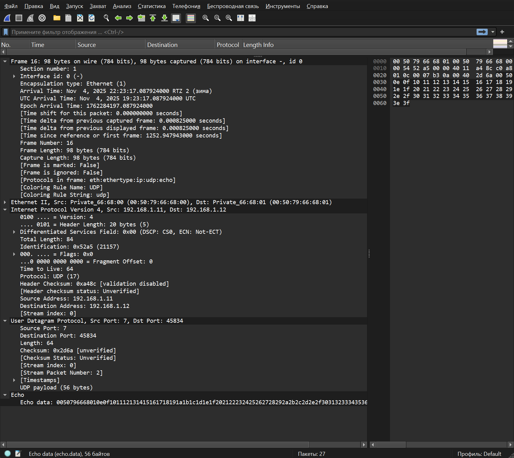{#fig:018 width=70%}

Попробуем осуществить ping по TCP. Видим немного необычный вывод. Сначала устанавливается воединение (хендшейк), после чего отправляется пакет, и соединение закрывается (рис. [-@fig:019]).

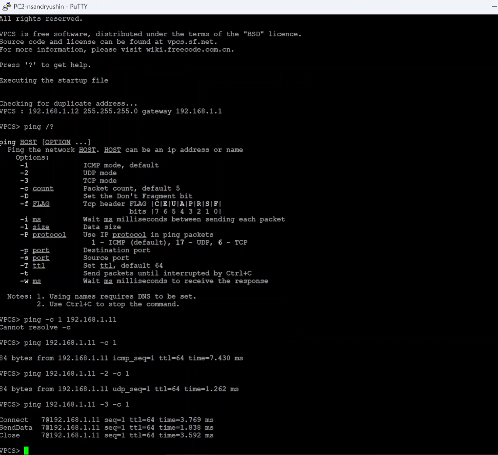{#fig:019 width=70%}

В Wireshark это выглядит следующим образом. Первые 3 пакета по tcp это процесс установки соединения, потом идёт наш эхо пакет в сторону первого терминала, после чего первый терминал отправляет ответом не echo ответ, а обычный пакет TCP с флагом ack, что означает, что ответ был получен. После этого последние 3 пакета нужны для закрытия соединения (рис. [-@fig:020]).

{#fig:020 width=70%}

Рассмотрим echo пакет TCP. Как видим, тут содержится информация о портах, флагах tcp, а также поле Data. Оно содержит совсем другой набор байт, нежели ICMP и UDP (рис. [-@fig:021]).

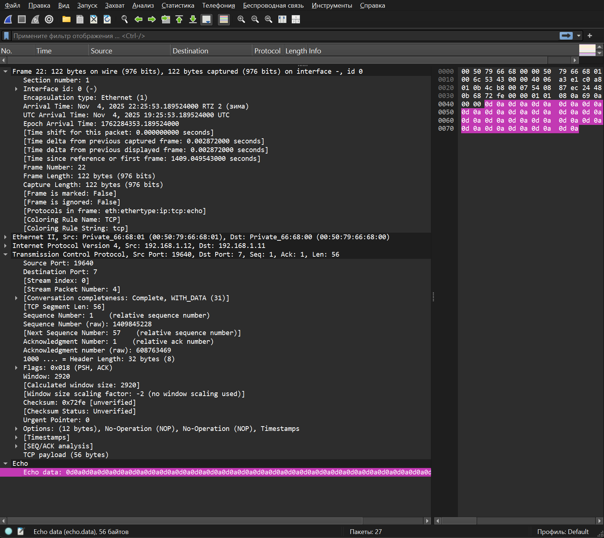{#fig:021 width=70%}

Теперь остановим захват пакетов (рис. [-@fig:022]).

{#fig:022 width=70%}

И теперь создадим новый проект (рис. [-@fig:023]).

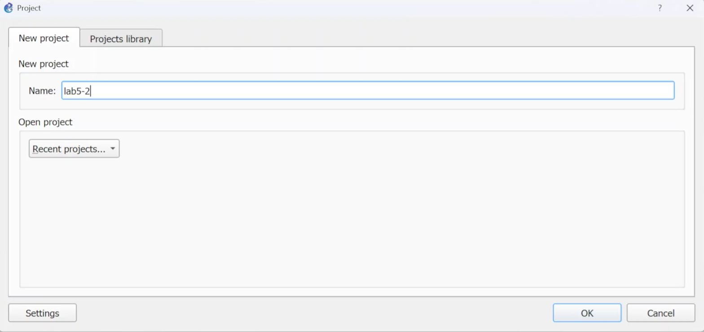{#fig:023 width=70%}

Реализуем следующую схему сети, использующую теперь роутер frr (рис. [-@fig:024]).

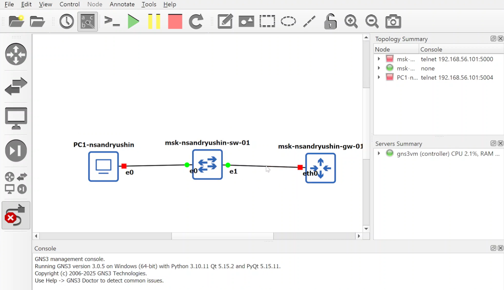{#fig:024 width=70%}

Между роутером и свитчём начнём захват пакетов (рис. [-@fig:025]).

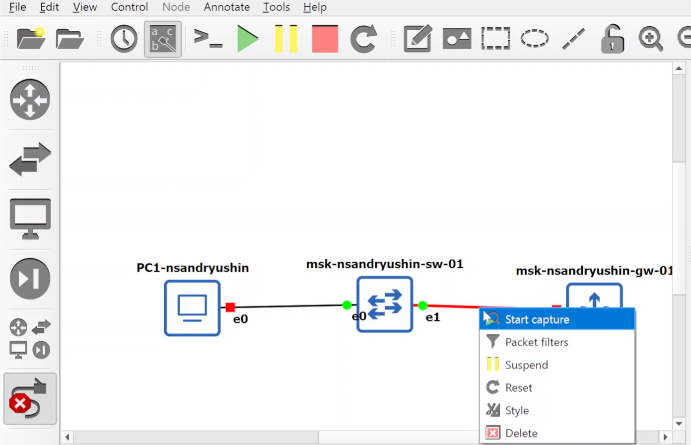{#fig:025 width=70%}

Подтвердим захват (рис. [-@fig:026]).

{#fig:026 width=70%}

И запустим все устройства в сети (рис. [-@fig:027]).

{#fig:027 width=70%}

И откроем консоли всех устройств (рис. [-@fig:028]).

{#fig:028 width=70%}

Нам откроются окна консолей терминала и роутера (рис. [-@fig:029]).

{#fig:029 width=70%}

В терминале настроим айпи. Пусть айпи будет 192.168.1.10, а шлюз 192.168.1.1 (рис. [-@fig:030]).

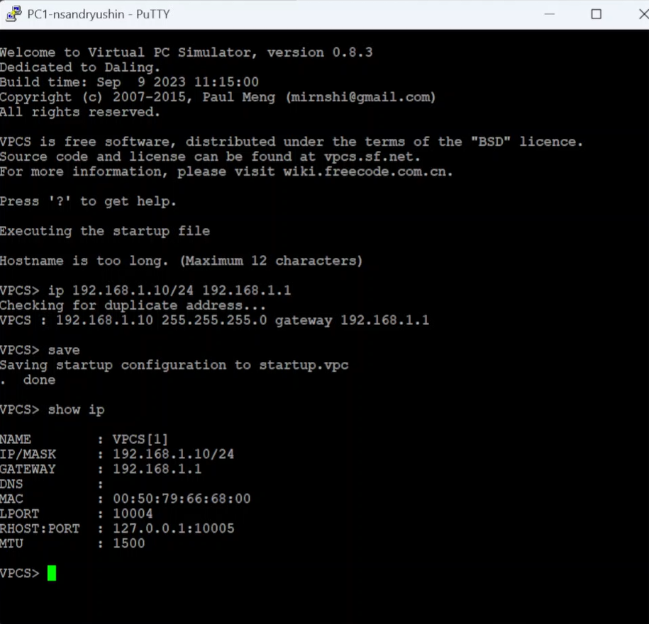{#fig:030 width=70%}

Теперь настроим роутер. Сменим на нём имя хоста, а также настроим интерфейс eth0, подключенный к свитчу. Айпи этого интерфейса - это адрес шлюза терминала из прошлого шага - 192.168.1.1. Сохраним эти настройки и убедимся в том, что они применились (рис. [-@fig:031]).

{#fig:031 width=70%}

Также посмотрим, что интерфейс eth0 действительно имеет нужный айпи (рис. [-@fig:032]).

{#fig:032 width=70%}

Теперь с терминала попробуем сделать ping к роутеру (рис. [-@fig:033]).

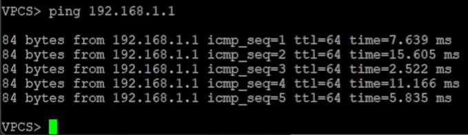{#fig:033 width=70%}

Как видим, было 5 пар echo пакетов формата запрос-ответ от клиента к роутеру и от роутера к клиенту (рис. [-@fig:034]).

{#fig:034 width=70%}

ниже приведено детальное содержание одного из пакетов. Все пакеты очень похожи, и основное содержание таких пакетов было рассмотрено ранее (рис. [-@fig:035]).

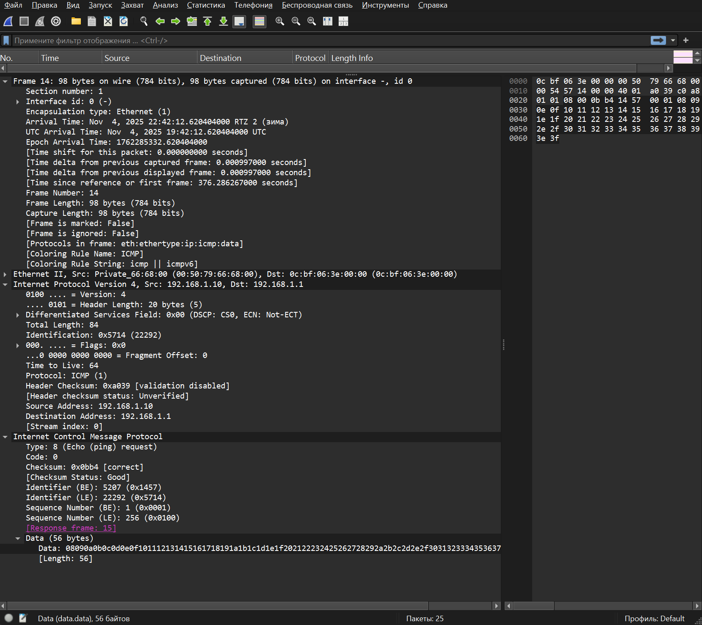{#fig:035 width=70%}

Остановим захват пакетов (рис. [-@fig:036]).

{#fig:036 width=70%}

И выключим все устройства (рис. [-@fig:037]).

{#fig:037 width=70%}

Создадим новый проект (рис. [-@fig:038]).

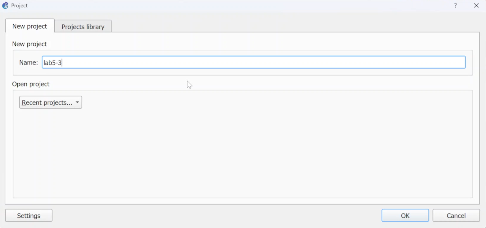{#fig:038 width=70%}

И реализуем такую схему сети, с роутером vyos (рис. [-@fig:039]).

{#fig:039 width=70%}

Начнём захват пакетов проходящих через кабель между роутером и свитчём (рис. [-@fig:040]).

{#fig:040 width=70%}

И подтвердим захват (рис. [-@fig:041]).

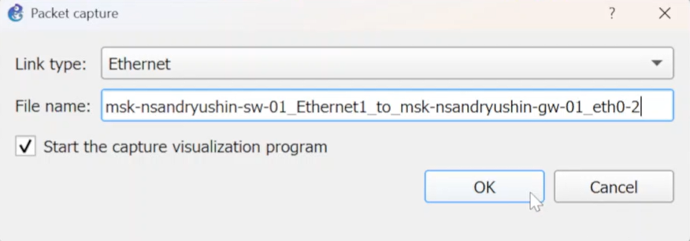{#fig:041 width=70%}

Включим все устройства (рис. [-@fig:042]).

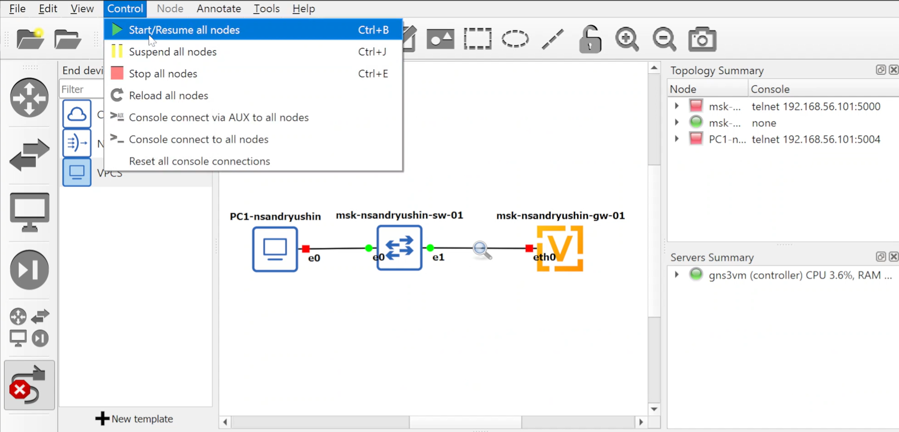{#fig:042 width=70%}

И запустим консоли для всех устройств (рис. [-@fig:043]).

{#fig:043 width=70%}

Откроются 2 консоли, для терминала-клиента и роутера vyos (рис. [-@fig:044]).

{#fig:044 width=70%}

Настроим клиент, установив его ip равным 192.168.1.10 (рис. [-@fig:045]).

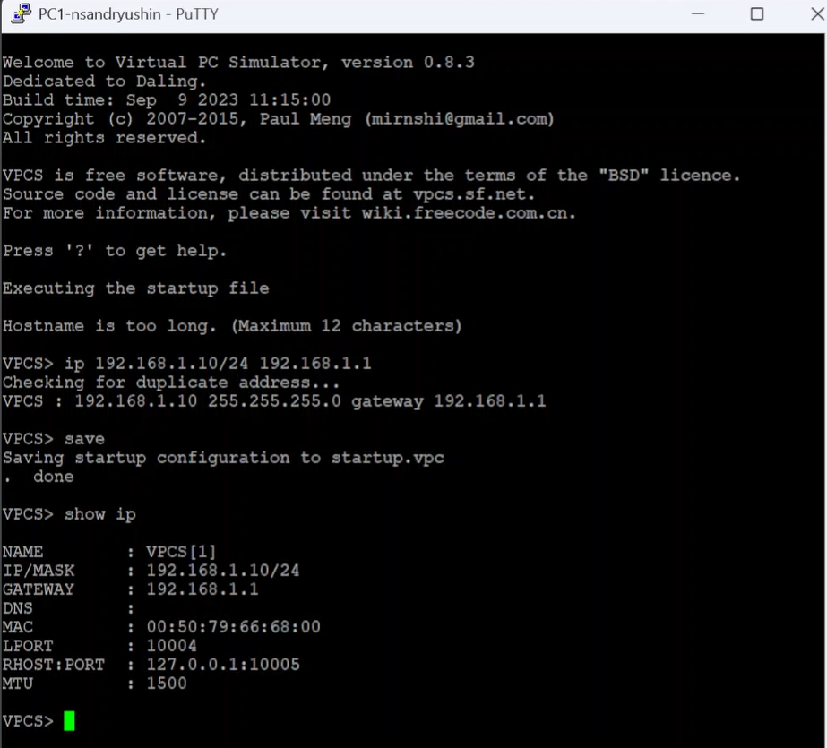{#fig:045 width=70%}

Далее настроим vyos. При попытке установки vyos скажет,что система и так установлена. Это связано с тем, что мы использовали образ системы qcow2 при создании шаблона в прошлой лабораторной работе (рис. [-@fig:046]).

{#fig:046 width=70%}

Сконфигурируем теперь имя хоста и айпи, сделав айпи равным 192.168.1.1 (рис. [-@fig:047]).

{#fig:047 width=70%}

Видим, что на одном интерфейсе одновеменно и статический и динамический ip. На всякий случай исправим это, удалив dhcp с интерфейса eth0 (рис. [-@fig:048]).

{#fig:048 width=70%}

Сохраним теперь все изменения (рис. [-@fig:049]).

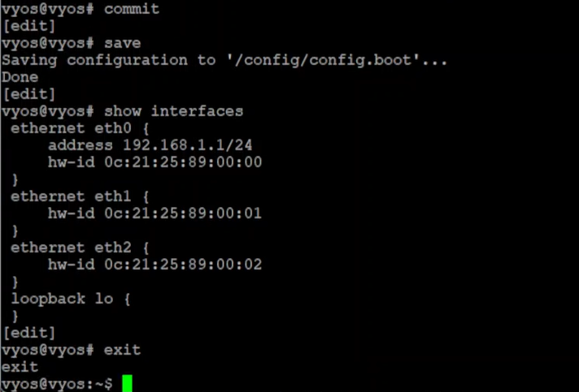{#fig:049 width=70%}

Попытаемся теперь пингануться к роутеру через клиента (рис. [-@fig:050]).

{#fig:050 width=70%}

Как видим, echo пакеты прошли, и ситуация такая же, что и с прошлым роутером - frr (рис. [-@fig:051]).

{#fig:051 width=70%}

Остановим захват пакетов (рис. [-@fig:052]).

{#fig:052 width=70%}

И остановим устройства сети (рис. [-@fig:053]).

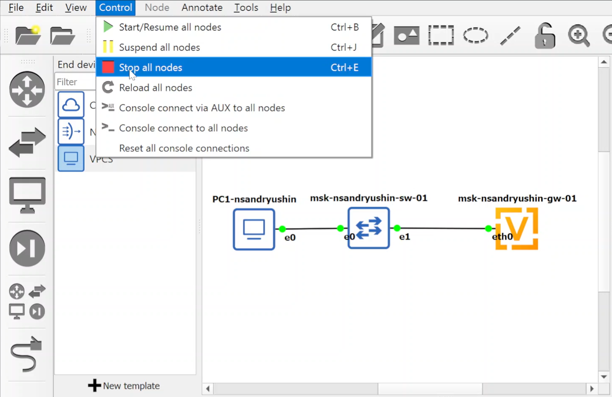{#fig:053 width=70%}

# Выводы

В результате выполнения лабораторной работы были получены навыки работы с простейшими моделями сети, их моделированием и анализом трафика в Wireshark
