---
## Front matter
title: "Отчёт о лабораторной работе"
subtitle: "Лабораторная работа 8"
author: "Андрюшин Никита Сергеевич"

## Generic otions
lang: ru-RU
toc-title: "Содержание"

## Bibliography
bibliography: bib/cite.bib
csl: pandoc/csl/gost-r-7-0-5-2008-numeric.csl

## Pdf output format
toc: true # Table of contents
toc-depth: 2
lof: true # List of figures
lot: true # List of tables
fontsize: 12pt
linestretch: 1.5
papersize: a4
documentclass: scrreprt
## I18n polyglossia
polyglossia-lang:
  name: russian
  options:
	- spelling=modern
	- babelshorthands=true
polyglossia-otherlangs:
  name: english
## I18n babel
babel-lang: russian
babel-otherlangs: english
## Fonts
mainfont: IBM Plex Serif
romanfont: IBM Plex Serif
sansfont: IBM Plex Sans
monofont: IBM Plex Mono
mathfont: STIX Two Math
mainfontoptions: Ligatures=Common,Ligatures=TeX,Scale=0.94
romanfontoptions: Ligatures=Common,Ligatures=TeX,Scale=0.94
sansfontoptions: Ligatures=Common,Ligatures=TeX,Scale=MatchLowercase,Scale=0.94
monofontoptions: Scale=MatchLowercase,Scale=0.94,FakeStretch=0.9
mathfontoptions:
## Biblatex
biblatex: true
biblio-style: "gost-numeric"
biblatexoptions:
  - parentracker=true
  - backend=biber
  - hyperref=auto
  - language=auto
  - autolang=other*
  - citestyle=gost-numeric
## Pandoc-crossref LaTeX customization
figureTitle: "Рис."
tableTitle: "Таблица"
listingTitle: "Листинг"
lofTitle: "Список иллюстраций"
lotTitle: "Список таблиц"
lolTitle: "Листинги"
## Misc options
indent: true
header-includes:
  - \usepackage{indentfirst}
  - \usepackage{float} # keep figures where there are in the text
  - \floatplacement{figure}{H} # keep figures where there are in the text
---

# Цель работы

Изучение принципов маршрутизации в IPv4- и IPv6-сетях и принципов настройки сетевого оборудования

# Выполнение работы

Создадим новый проект в GNS3 с именем «lab8» (рис. [-@fig:001]).

{#fig:001}

Соберём топологию сети согласно заданию, разместив коммутаторы, маршрутизаторы FRR и оконечные устройства (рис. [-@fig:002]).

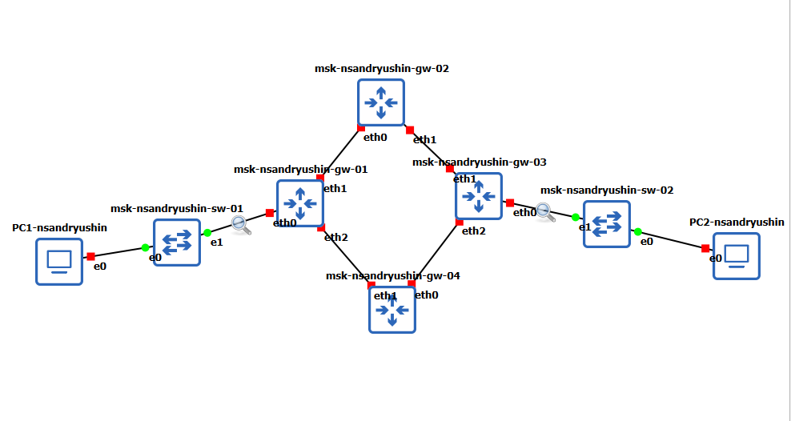{#fig:002}

Настроим IP-адрес и шлюз по умолчанию на PC1 (рис. [-@fig:003]).

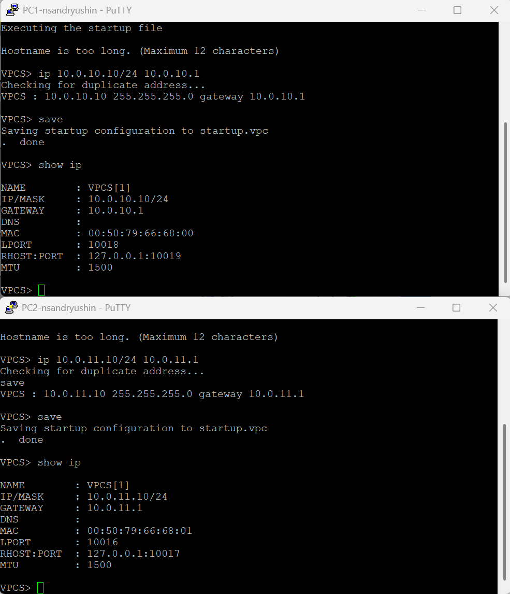{#fig:003}

Настроим IP-адрес и шлюз по умолчанию на PC2 (рис. [-@fig:004]).

{#fig:004}

На маршрутизаторе gw-01 зададим имя хоста и настроим IPv4-адреса на интерфейсах eth0, eth1 и eth2 (рис. [-@fig:005]).

{#fig:005}

На маршрутизаторе gw-02 зададим имя хоста и настроим IPv4-адреса на интерфейсах eth0 и eth1 (рис. [-@fig:006]).

{#fig:006}

На маршрутизаторе gw-03 зададим имя хоста и настроим IPv4-адреса на интерфейсах eth0, eth1 и eth2 (рис. [-@fig:007]).

{#fig:007}

На маршрутизаторе gw-04 зададим имя хоста и настроим IPv4-адреса на интерфейсах eth0 и eth1 (рис. [-@fig:008]).

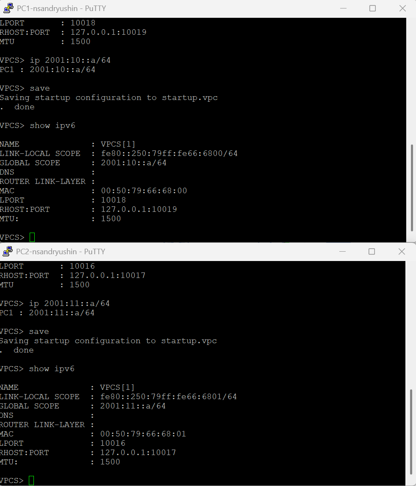{#fig:008}

Настроим IPv6-адрес на PC1 (рис. [-@fig:009]).

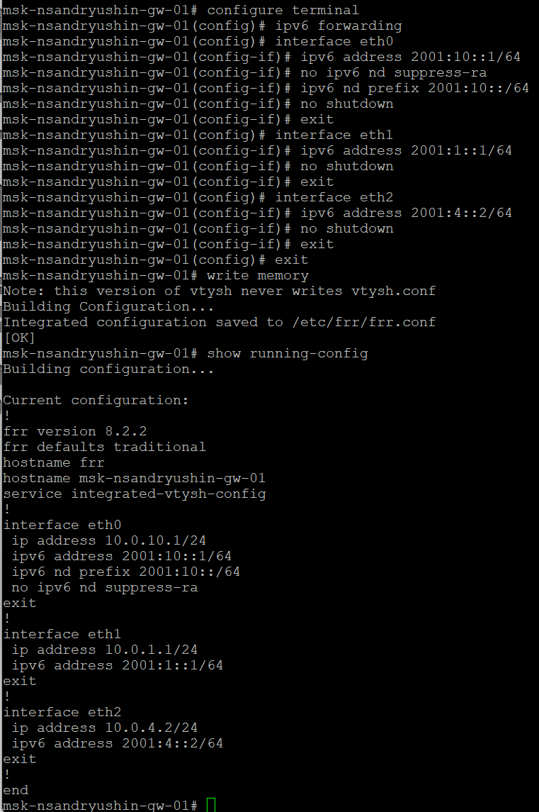{#fig:009}

Настроим IPv6-адрес на PC2 (рис. [-@fig:010]).

{#fig:010}

На маршрутизаторе gw-01 включим маршрутизацию IPv6 (forwarding) и настроим IPv6-адреса на интерфейсах (рис. [-@fig:011]).

{#fig:011}

На маршрутизаторе gw-02 включим маршрутизацию IPv6 и настроим адреса на интерфейсах (рис. [-@fig:012]).

{#fig:012}

На маршрутизаторе gw-03 включим маршрутизацию IPv6 и настроим адреса на интерфейсах (рис. [-@fig:013]).

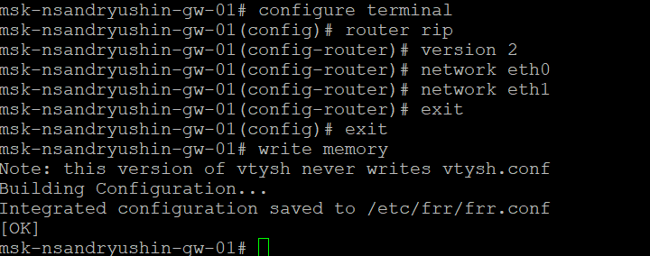{#fig:013}

На маршрутизаторе gw-04 включим маршрутизацию IPv6 и настроим адреса на интерфейсах (рис. [-@fig:014]).

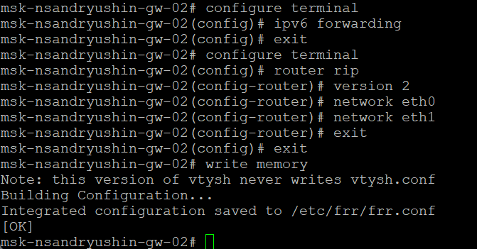{#fig:014}

Настроим протокол динамической маршрутизации RIP версии 2 на маршрутизаторе gw-01, объявив подключенные сети (рис. [-@fig:015]).

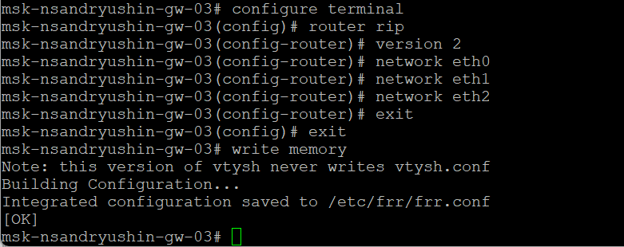{#fig:015}

Настроим протокол RIP версии 2 на маршрутизаторе gw-02 (рис. [-@fig:016]).

{#fig:016}

Настроим протокол RIP версии 2 на маршрутизаторе gw-03 (рис. [-@fig:017]).

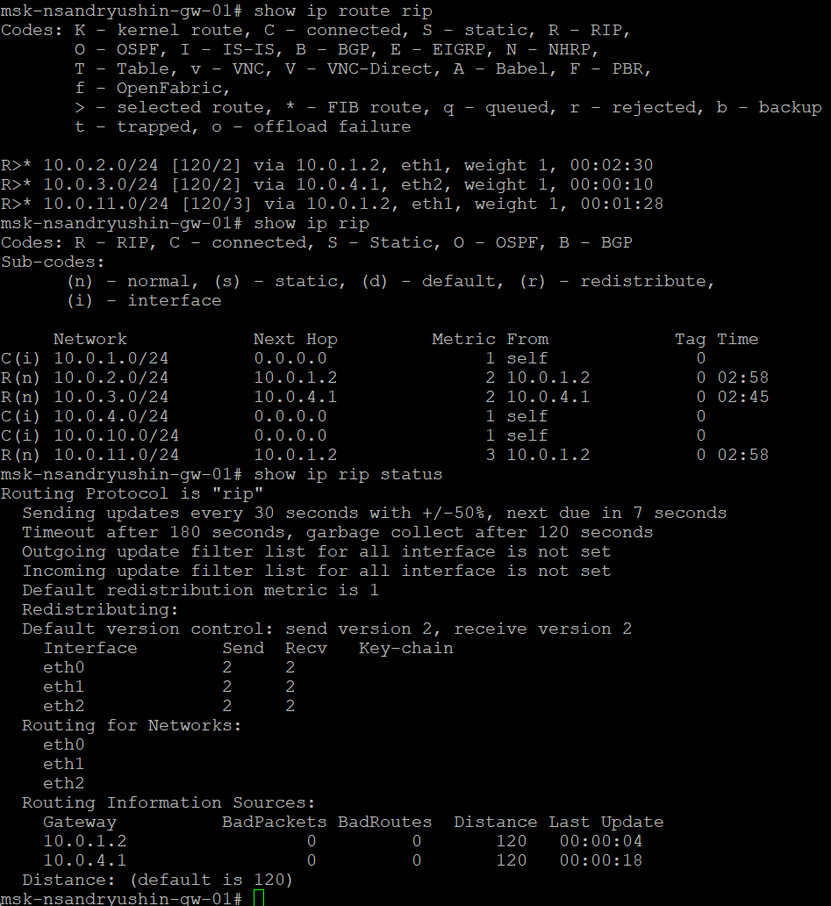{#fig:017}

Настроим протокол RIP версии 2 на маршрутизаторе gw-04 (рис. [-@fig:018]).

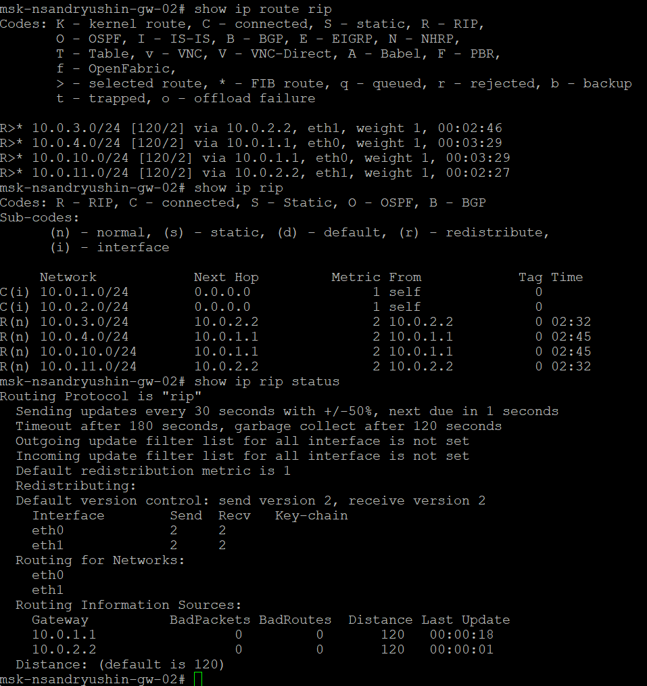{#fig:018}

Проверим таблицу маршрутизации и статус протокола RIP на gw-01 (рис. [-@fig:019]).

{#fig:019}

Проверим таблицу маршрутизации и статус протокола RIP на gw-02 (рис. [-@fig:020]).

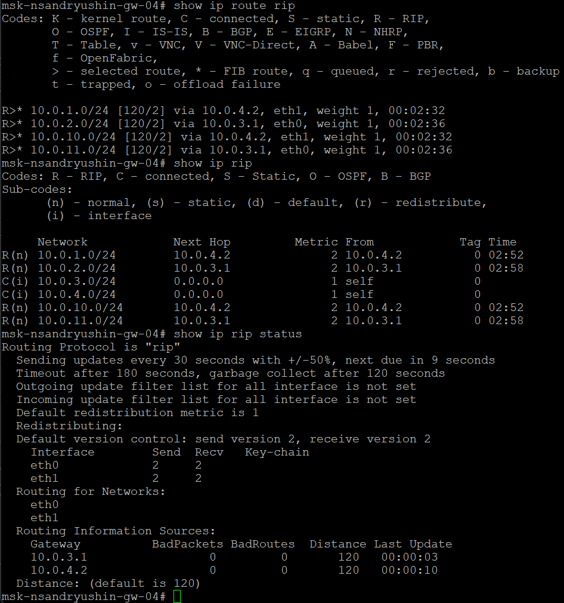{#fig:020}

Проверим таблицу маршрутизации и статус протокола RIP на gw-03 (рис. [-@fig:021]).

{#fig:021}

Проверим таблицу маршрутизации и статус протокола RIP на gw-04 (рис. [-@fig:022]).

{#fig:022}

Проверим связность между PC1 и PC2 с помощью утилит ping и trace. Трассировка показывает прохождение пакетов через gw-04 (рис. [-@fig:023]).

{#fig:023}

Посмотрим метрики маршрутов в таблице RIP на gw-01 (рис. [-@fig:024]).

{#fig:024}

Для проверки отказоустойчивости выключим интерфейс eth0 на маршрутизаторе gw-04 (рис. [-@fig:025]).

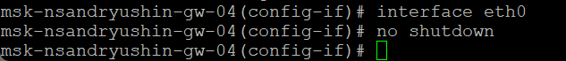{#fig:025}

Убедимся, что маршрут через отключенный интерфейс стал недоступен (метрика 16) в таблице маршрутизации gw-01 (рис. [-@fig:026]).

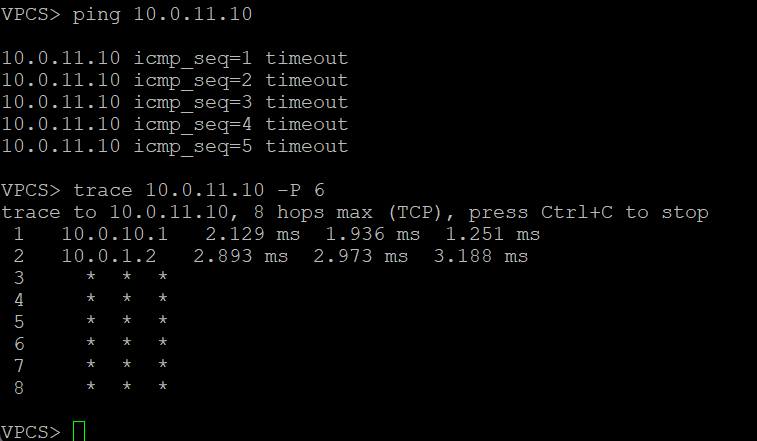{#fig:026}

Включим интерфейс eth0 на маршрутизаторе gw-04 обратно (рис. [-@fig:027]).

{#fig:027}

Проверим доступность удаленного узла с PC1. Наблюдаем потери пакетов и незавершенную трассировку, что говорит о процессе перестроения маршрута (рис. [-@fig:028]).

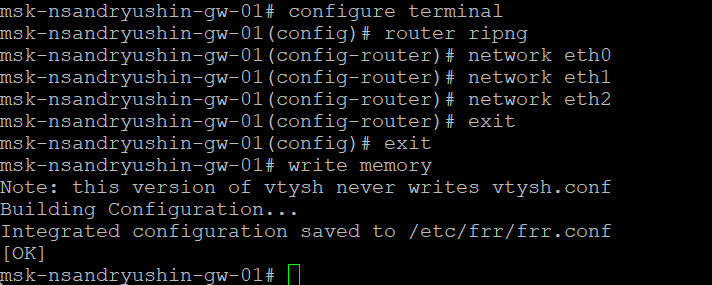{#fig:028}

Проанализируем захваченные пакеты протокола RIPv2 в Wireshark (рис. [-@fig:029]).

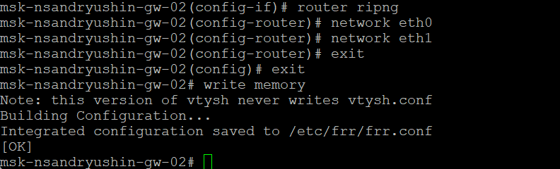{#fig:029}

Настроим протокол RIPng (для IPv6) на маршрутизаторе gw-01 (рис. [-@fig:030]).

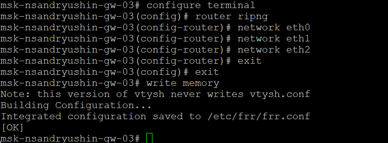{#fig:030}

Настроим протокол RIPng на маршрутизаторе gw-02 (рис. [-@fig:031]).

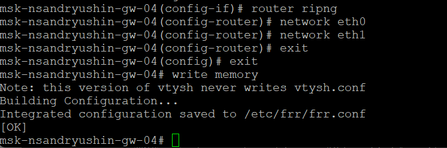{#fig:031}

Настроим протокол RIPng на маршрутизаторе gw-03 (рис. [-@fig:032]).

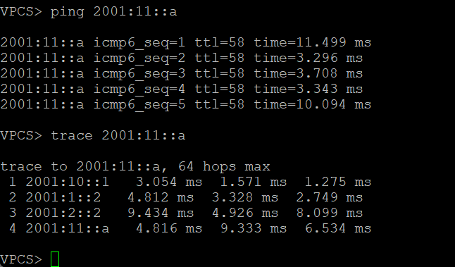{#fig:032}

Настроим протокол RIPng на маршрутизаторе gw-04 (рис. [-@fig:033]).

{#fig:033}

Проверим IPv6-связность между PC1 и PC2. Трассировка показывает маршрут через gw-02 (рис. [-@fig:034]).

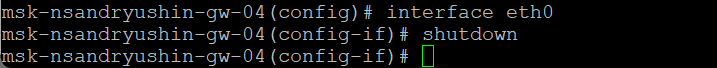{#fig:034}

Просмотрим таблицу маршрутизации RIPng на gw-01 (рис. [-@fig:035]).

{#fig:035}

Сымитируем сбой, отключив интерфейс eth0 на маршрутизаторе gw-04 (рис. [-@fig:036]).

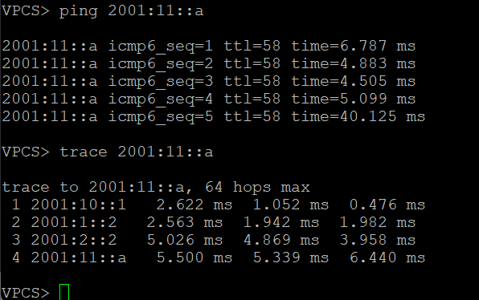{#fig:036}

Посмотрим изменения в таблице маршрутизации RIPng на gw-01 (рис. [-@fig:037]).

{#fig:037}

Снова проверим доступность узлов с PC1 (рис. [-@fig:038]).

{#fig:038}

В Wireshark наблюдаем ICMPv6 сообщения о превышении лимита времени (Time Exceeded), что свидетельствует о проблемах маршрутизации (петлях) в момент сходимости (рис. [-@fig:039]).

{#fig:039}

Также в трафике присутствуют запросы и ответы ping (Echo) и пакеты RIPng (рис. [-@fig:040]).

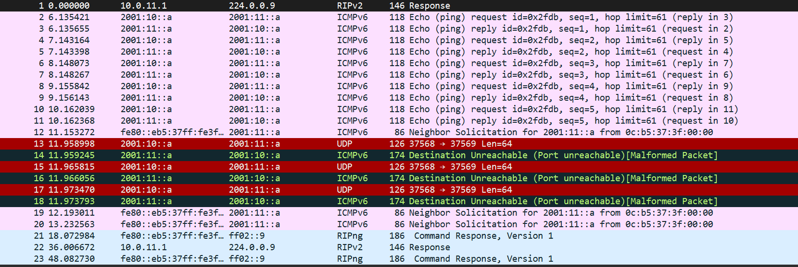{#fig:040}

Перейдем к настройке OSPF. На маршрутизаторе gw-01 настроим процесс OSPF и привяжем сети к зоне 0 (рис. [-@fig:041]).

{#fig:041}

Настроим OSPF на маршрутизаторе gw-02, указав сети и зону (рис. [-@fig:042]).

{#fig:042}

Настроим OSPF на маршрутизаторе gw-03 (рис. [-@fig:043]).

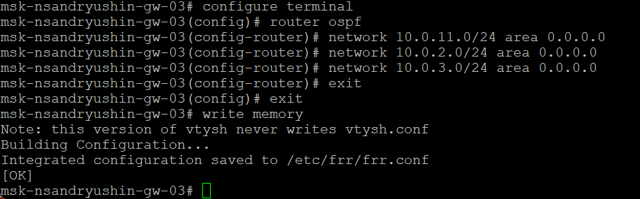{#fig:043}

Настроим OSPF на маршрутизаторе gw-04 (рис. [-@fig:044]).

{#fig:044}

Проверим связность с помощью ping и trace с PC1. Трассировка показывает маршрут через gw-02 (рис. [-@fig:045]).

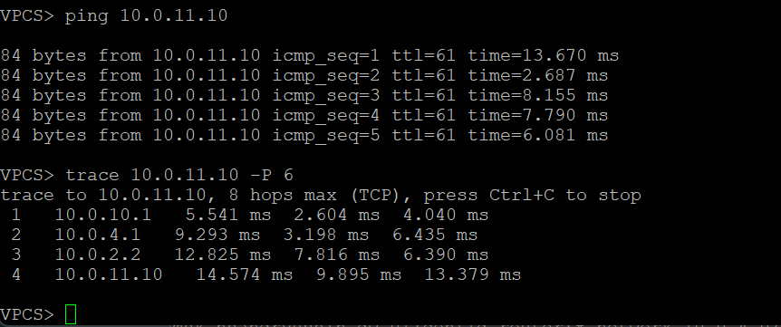{#fig:045}

Посмотрим список соседей OSPF и таблицу маршрутизации на gw-01 (рис. [-@fig:046]).

{#fig:046}

Повторно выведем информацию о соседях и маршрутах OSPF на gw-01 (рис. [-@fig:047]).

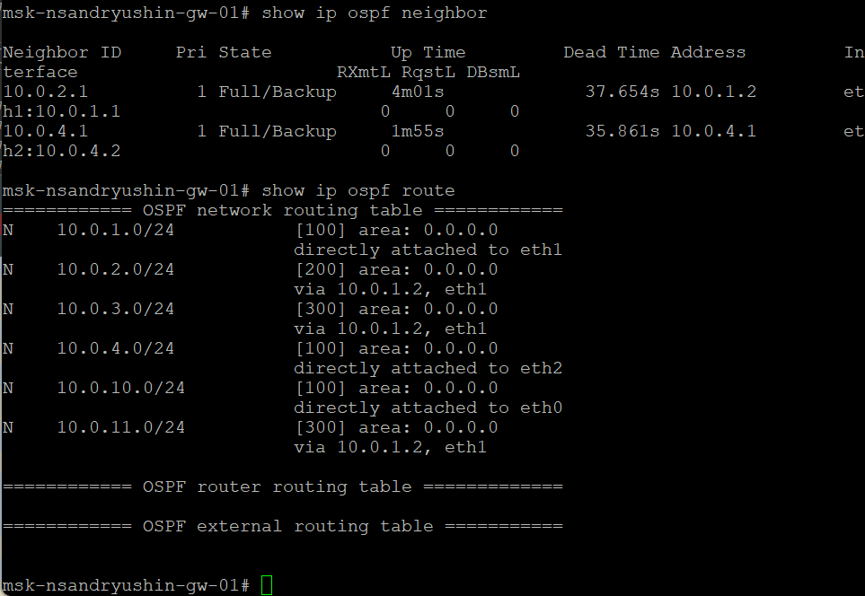{#fig:047}

Снова выполним трассировку маршрута с PC1 до PC2 (рис. [-@fig:048]).

{#fig:048}

Убедимся, что интерфейс eth0 на gw-04 включен (команда `no shutdown`) (рис. [-@fig:049]).

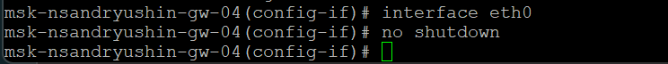{#fig:049}

Проверим трассировку маршрута; теперь трафик может идти через gw-04 (рис. [-@fig:050]).

{#fig:050}

В Wireshark проанализируем пакеты, среди которых видны сообщения ICMPv6 о недоступности назначения и превышении времени (рис. [-@fig:051]).

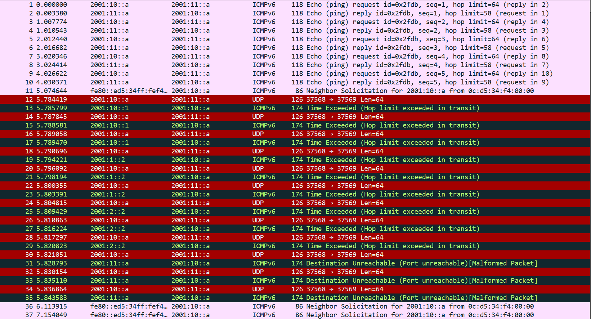{#fig:051}

Продолжаем наблюдение за служебным трафиком OSPF Hello и RIPv2 в Wireshark (рис. [-@fig:052]).

{#fig:052}

Зафиксируем ICMP-запросы и ARP-пакеты в Wireshark (рис. [-@fig:053]).

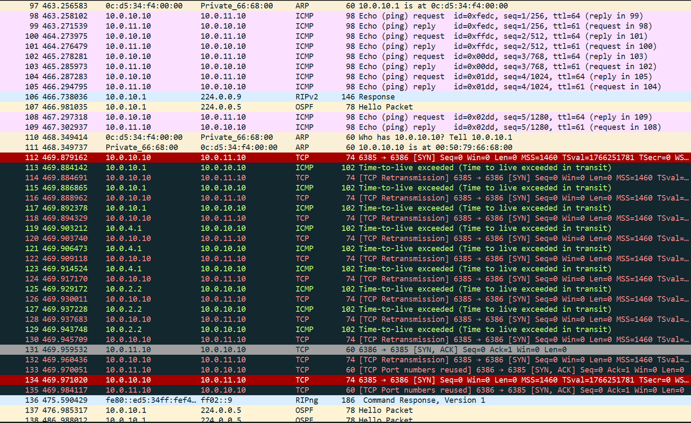{#fig:053}

Наблюдаем TCP-ретрансмиссии и сообщения об истечении времени жизни пакета (Time-to-live exceeded) в Wireshark (рис. [-@fig:054]).

{#fig:054}

Настроим OSPFv3 для IPv6 на маршрутизаторе gw-01, задав router-id 1.1.1.1 и привязав интерфейсы к зоне 0 (рис. [-@fig:055]).

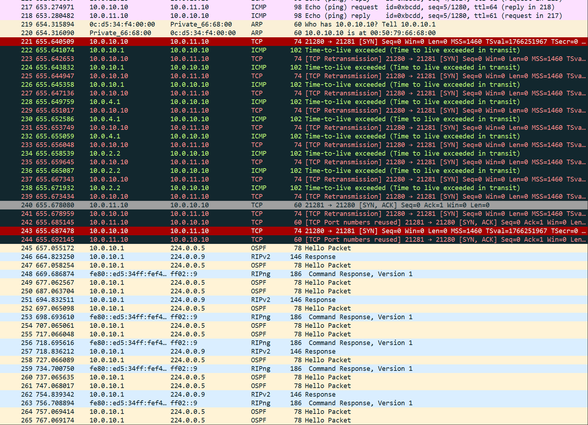{#fig:055}

Настроим OSPFv3 на маршрутизаторе gw-02 с router-id 2.2.2.2 (рис. [-@fig:056]).

{#fig:056}

Настроим OSPFv3 на маршрутизаторе gw-03 с router-id 3.3.3.3 (рис. [-@fig:057]).

{#fig:057}

Настроим OSPFv3 на маршрутизаторе gw-04 с router-id 4.4.4.4 (рис. [-@fig:058]).

{#fig:058}

Проверим IPv6-связность с PC1. Трассировка проходит успешно (рис. [-@fig:059]).

{#fig:059}

Проверим таблицу соседей и маршрутов OSPFv3 на gw-01 (рис. [-@fig:060]).

{#fig:060}

В Wireshark наблюдаем сообщения ICMPv6 Time Exceeded, свидетельствующие о проблемах доставки пакетов (рис. [-@fig:061]).

{#fig:061}

Фиксируем сообщения ICMPv6 Destination Unreachable (Port unreachable) в трафике (рис. [-@fig:062]).

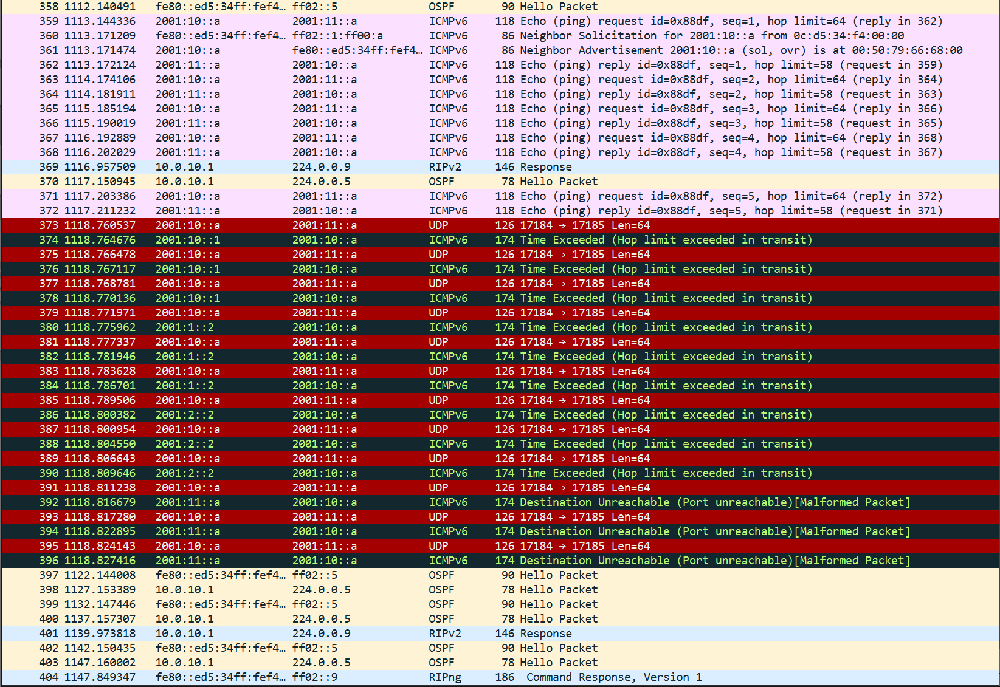{#fig:062}

Продолжаем наблюдать поток ошибок Destination Unreachable в Wireshark (рис. [-@fig:063]).

{#fig:063}

Создадим новый проект «lab8-1» для выполнения следующей части задания (рис. [-@fig:064]).

{#fig:064}

Соберем новую топологию сети с использованием маршрутизаторов VyOS (рис. [-@fig:065]).

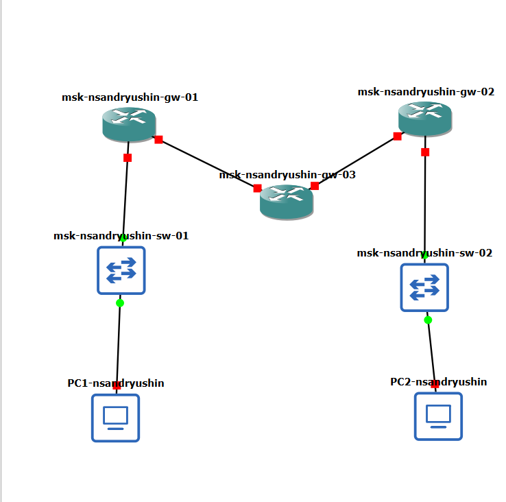{#fig:065}

# Выводы

В результате выполнения лабораторной работы были получены навыки настройки маршрутизации
