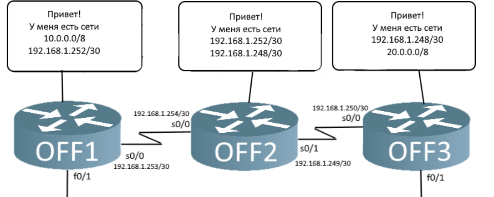
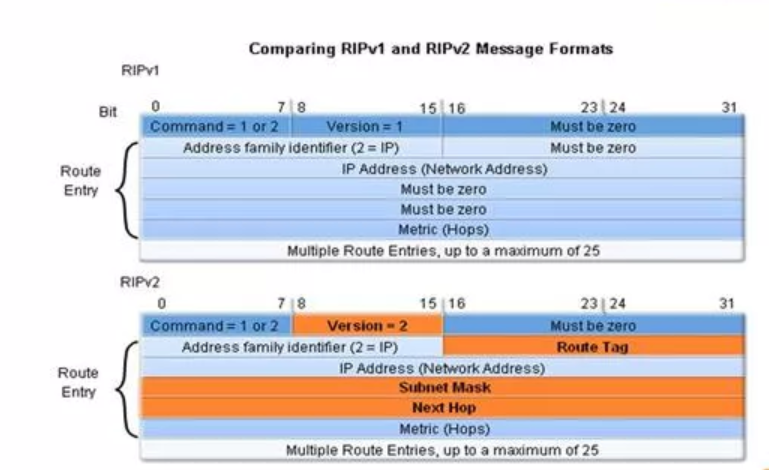
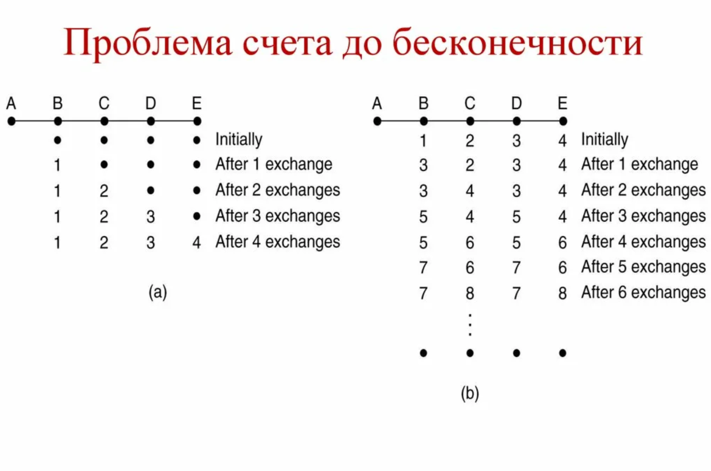

---
## Front matter
title: "Доклад"
subtitle: "Протокол маршрутизации RIP"
author: "Андрюшин Никита Сергеевич"

## Generic otions
lang: ru-RU
toc-title: "Содержание"

## Bibliography
bibliography: bib/cite.bib
csl: pandoc/csl/gost-r-7-0-5-2008-numeric.csl

## Pdf output format
toc: true # Table of contents
toc-depth: 2
lof: true # List of figures
lot: true # List of tables
fontsize: 12pt
linestretch: 1.5
papersize: a4
documentclass: scrreprt
## I18n polyglossia
polyglossia-lang:
  name: russian
  options:
	- spelling=modern
	- babelshorthands=true
polyglossia-otherlangs:
  name: english
## I18n babel
babel-lang: russian
babel-otherlangs: english
## Fonts
mainfont: IBM Plex Serif
romanfont: IBM Plex Serif
sansfont: IBM Plex Sans
monofont: IBM Plex Mono
mathfont: STIX Two Math
mainfontoptions: Ligatures=Common,Ligatures=TeX,Scale=0.94
romanfontoptions: Ligatures=Common,Ligatures=TeX,Scale=0.94
sansfontoptions: Ligatures=Common,Ligatures=TeX,Scale=MatchLowercase,Scale=0.94
monofontoptions: Scale=MatchLowercase,Scale=0.94,FakeStretch=0.9
mathfontoptions:
## Biblatex
biblatex: true
biblio-style: "gost-numeric"
biblatexoptions:
  - parentracker=true
  - backend=biber
  - hyperref=auto
  - language=auto
  - autolang=other*
  - citestyle=gost-numeric
## Pandoc-crossref LaTeX customization
figureTitle: "Рис."
tableTitle: "Таблица"
listingTitle: "Листинг"
lofTitle: "Список иллюстраций"
lotTitle: "Список таблиц"
lolTitle: "Листинги"
## Misc options
indent: true
header-includes:
  - \usepackage{indentfirst}
  - \usepackage{float} # keep figures where there are in the text
  - \floatplacement{figure}{H} # keep figures where there are in the text
---

# Введение

В условиях непрерывного роста и усложнения компьютерных сетей, от небольших офисных LAN до глобальной сети Интернет, ключевой задачей становится обеспечение связности между узлами. Маршрутизаторы, являясь «мозгом» сети, должны принимать решения о том, по какому пути отправлять пакеты данных к конечному адресату. Для автоматизации этого процесса были разработаны протоколы динамической маршрутизации, которые позволяют устройствам обмениваться информацией о топологии сети и самостоятельно строить таблицы маршрутизации.   

Один из старейших и наиболее фундаментальных протоколов этого класса — Routing Information Protocol (RIP). Несмотря на то что в современных крупных сетях он в значительной степени вытеснен более сложными протоколами, такими как OSPF и BGP, изучение RIP имеет огромное значение. Он заложил базовые принципы дистанционно-векторной маршрутизации и служит идеальной отправной точкой для понимания более продвинутых технологий.   

Целью данной работы является изучение архитектуры, принципов работы, эволюции версий и ключевых ограничений протокола RIP, а также определение его исторической роли и нишевого применения в современных сетевых инфраструктурах.   

# Теоретические основы и алгоритм работы

Для глубокого понимания предмета исследования необходимо определить фундаментальный принцип работы RIP, который отличает его от протоколов состояния канала (link-state). RIP относится к классу дистанционно-векторных (Distance-Vector) протоколов.   

«Философия» протокола строится на принципе «слухов» или «сарафанного радио». Каждый маршрутизатор не имеет полной карты сети. Он знает только о своих непосредственно подключенных соседях и о маршрутах, которые эти соседи ему сообщили. Основной метрикой для выбора лучшего пути в RIP является количество хопов (hop count) — число маршрутизаторов, которые необходимо пройти до сети назначения. Путь с наименьшим количеством хопов считается наилучшим. Максимально допустимое значение метрики — 15, значение 16 означает, что сеть недостижима.   

Глобально работа протокола строится на следующем цикле. Во-первых, каждый маршрутизатор периодически (по умолчанию каждые 30 секунд) отправляет всю свою таблицу маршрутизации соседям. Во-вторых, получив обновление от соседа, маршрутизатор анализирует его: добавляет новые маршруты, обновляет метрику для существующих (прибавляя 1 к полученной) и выбирает путь с наименьшим числом хопов. В-третьих, если информация о каком-либо маршруте не обновляется в течение определенного времени, он считается недействительным и удаляется. Эта простота алгоритма, основанного на Bellman-Ford, сделала RIP чрезвычайно легким в настройке и внедрении.   

# RIPv1: Основоположник классовой маршрутизации

Первая стандартизированная версия протокола, описанная в RFC 1058, заложила основы. Однако она обладала рядом серьезных ограничений, обусловленных эпохой ее создания.   

RIPv1 является классовым протоколом маршрутизации. Это означает, что он не передает информацию о маске подсети в маршрутных обновлениях. Маршрутизатор определяет маску на основе первого октета IP-адреса (класс A, B или C). Это приводило к неэффективному использованию адресного пространства и делало невозможным применение технологии бесклассовой адресации (CIDR) и сетей с переменной длиной маски (VLSM). Кроме того, для рассылки обновлений использовались широковещательные (broadcast) пакеты на адрес 255.255.255.255, что создавало излишнюю нагрузку на все устройства в сегменте сети, даже те, которые не участвовали в маршрутизации. Аутентификация в RIPv1 отсутствовала, что делало сеть уязвимой для атак с внедрением ложных маршрутов.   

# RIPv2: Ответ на недостатки

С ростом Интернета и истощением пула IPv4-адресов ограничения RIPv1 стали критическими. На смену ему пришла вторая версия, RIPv2 (RFC 2453), которая решила ключевые проблемы предшественника.   

Главным нововведением стала поддержка бесклассовой маршрутизации. RIPv2 включает маску подсети в состав маршрутного обновления, что позволило использовать VLSM и CIDR, обеспечивая гибкое и экономное распределение IP-адресов. Вместо широковещательной рассылки стала использоваться многоадресная (multicast) на адрес 224.0.0.9, благодаря чему обновления получали только маршрутизаторы, «слушающие» этот адрес. Также была добавлена поддержка простой аутентификации (открытым текстом или MD5), что повысило безопасность обмена маршрутной информацией.   

# RIPng: Адаптация для мира IPv6

Переход к новому протоколу адресации IPv6 потребовал создания соответствующей версии RIP. Так появился RIPng (RIP next generation), описанный в RFC 2080.   

RIPng не является революционным шагом вперед по сравнению с RIPv2, а скорее его адаптацией. Он сохраняет тот же алгоритм, метрику и ограничения по количеству хопов. Ключевые изменения коснулись формата пакетов и транспортного механизма для работы с адресами IPv6. RIPng работает поверх UDP, используя порт 521, а для рассылки обновлений применяется multicast-адрес FF02::9. По сути, он выполняет ту же самую функцию, что и RIPv2, но в сетях IPv6.   

# Ключевые ограничения и проблема «счета до бесконечности»

Несмотря на эволюцию, RIP сохранил ряд врожденных недостатков, которые ограничивают его применение.   

Самая известная проблема протокола — медленная сходимость и связанная с ней проблема «счета до бесконечноosti» (counting to infinity). Она возникает, когда один из маршрутов становится недоступным. Из-за особенностей обмена информацией маршрутизаторы могут попасть в петлю маршрутизации, постепенно увеличивая метрику до максимального значения 16, прежде чем понять, что путь недействителен. Это занимает много времени, в течение которого пакеты теряются. Для борьбы с этим были разработаны механизмы, такие как split horizon (не отправлять маршрут обратно в тот интерфейс, откуда он пришел) и route poisoning (немедленная отправка обновления с метрикой 16 для недоступного маршрута), но они решают проблему лишь частично.   

Другие важные ограничения:   

Примитивная метрика: Выбор пути только по числу хопов игнорирует реальную пропускную способность и задержку каналов. Путь через два быстрых оптоволоконных канала (2 хопа) будет считаться хуже, чем путь через три медленных радиоканала (3 хопа).   
Ограничение сети: Максимальное число хопов (15) делает RIP непригодным для больших сетей.   
Высокий трафик: Отправка всей таблицы маршрутизации каждые 30 секунд создает ненужную нагрузку, особенно в стабильных сетях.   

# Заключение

Проведенный анализ показывает, что протокол RIP является фундаментальным, но в значительной степени устаревшим инструментом маршрутизации. Его эволюция от классового RIPv1 к бесклассовому RIPv2 и далее к RIPng для IPv6 демонстрирует попытки адаптировать простой дистанционно-векторный алгоритм к меняющимся требованиям сетевых технологий.   

Простота настройки и низкие требования к ресурсам делают RIP полезным в образовательных целях для изучения основ динамической маршрутизации. Он также может найти ограниченное применение в очень маленьких, статичных сетях, где его недостатки (медленная сходимость, примитивная метрика) не являются критичными. Однако в современных корпоративных и провайдерских сетях его место давно заняли более совершенные протоколы состояния канала (OSPF, IS-IS) и протоколы векторного пути (BGP).   

Таким образом, RIP следует рассматривать как важную историческую веху и учебный инструмент, который заложил основу для развития сетевых технологий, но практическая ценность которого в сложных современных инфраструктурах стремится к нулю.   

# Список используемых источников

    Malkin, G. RFC 1058: Routing Information Protocol. — 1988.
    Malkin, G. RFC 2453: RIP Version 2. — 1998.
    Malkin, G., & Thompson, R. RFC 2080: RIPng for IPv6. — 1997.
    Таненбаум Э., Уэзеролл Д. Компьютерные сети. — 5-е изд. — СПб.: Питер, 2012.
    Официальная документация Cisco Systems по настройке протокола RIP [Электронный ресурс]. URL: https://www.cisco.com/c/en/us/support/docs/ip/routing-information-protocol-rip/13788-3.html
    Куроуз Дж., Росс К. Компьютерные сети. Подход сверху вниз. — 7-е изд. — М.: Эксмо, 2016.
